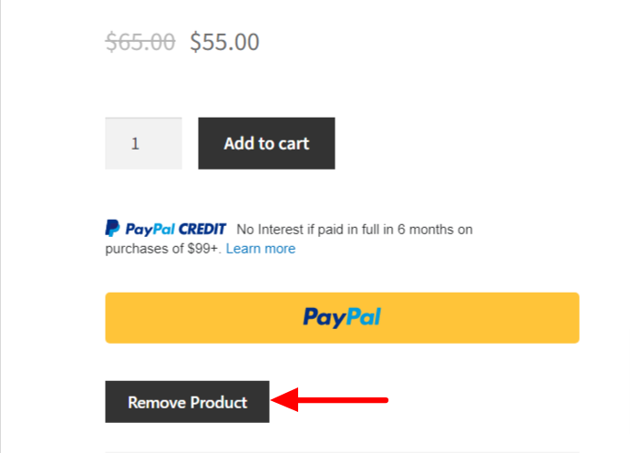

# Remove-Frontend-Product
The "Remove Product" plugin allows admins to remove products from the front-end product pages on a WooCommerce-powered website. The plugin adds a "Remove Product" link or button to the product pages, which can be clicked by an admin to delete the product. The plugin includes a security check to ensure that only users with the necessary permissions can delete products.

# Screenshots
 |  | 